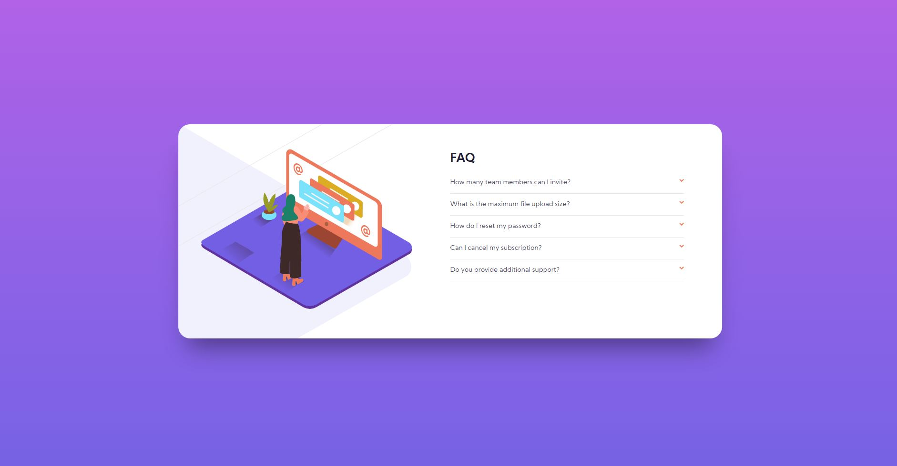

# Frontend Mentor - FAQ Accordion solution

## Introduction

This is a solution to the [FAQ Accordion challenge on Frontend Mentor](https://www.frontendmentor.io/challenges/faq-accordion-card-XlyjD0Oam). Frontend Mentor challenges help you improve your coding skills by building realistic projects.

## Overview

### The challenge

Users should be able to:

- View the optimal layout for the section depending on their device's screen size (assumed two sizes: mobile & desktop)
- Dropdown buttons display detail text and affect card styling

### Screenshot

### Links

- Solution URL: [My Solution on Frontend Mentor]()
- Live Site URL: [Social Proof hosted on Vercel](https://fem-faq-accordion-theta.vercel.app/)

## My process

### Technologies Applied & Skills Learned

- Semantic HTML5 markup
- SCSS (SASS)
- Flexbox
- jQuery
